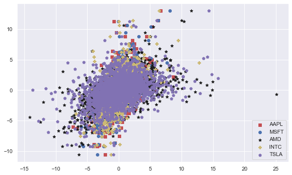
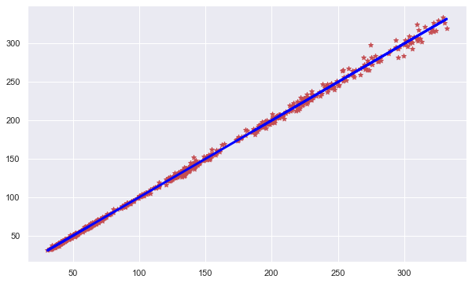
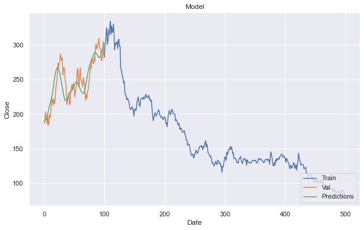
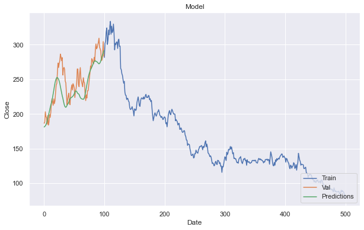
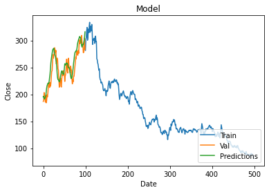

# Machine Learning 

## Linear regression 

### First of all in order to predict share price for one company using data from other companies wanted to make sure that we can recive accurate data with simply algorithm 


```python
df = pd.read_csv('main_dataframe.csv')
```


```python
plt.scatter(x=df['AAPL Daily change'],y=df['NVDA Daily change'],c='r',marker='s',label='AAPL')
plt.scatter(x=df['MSFT Daily change'],y=df['NVDA Daily change'],c='b',marker='o',label='MSFT')
plt.scatter(x=df['AMD Daily change'],y=df['NVDA Daily change'],c='k',marker='*',label='AMD')
plt.scatter(x=df['INTC Daily change'],y=df['NVDA Daily change'],c='y',marker='P',label='INTC')
plt.scatter(x=df['TSLA Daily change'],y=df['NVDA Daily change'],c='m',marker='p',label='TSLA')
plt.legend(numpoints=2,loc=4)
plt.show()

```


    

    

### As we  saw before corelation between "Daily change" valuse is preatty high 


```python
tdf = pd.DataFrame(df, columns = ['NVDA Close'])
tdf['Predicted Close'] = ((df['NVDA Open']*5+df['AAPL Daily change']*df['NVDA Open']/100+df['AMD Daily change']*df['NVDA Open']/100+df['INTC Daily change']*df['NVDA Open']/100+df['MSFT Daily change']*df['NVDA Open']/100+df['TSLA Daily change']*df['NVDA Open']/100)/5) 
tdf
tdf.drop(tdf.index[1000:2548], inplace=True)     
```

### To use linear regression we combied all Data to the mean wariable using simple math function

### After that we left with two Values  'NVDA Close' and ' 'Predicted Close'


```python
m=linear_model.LinearRegression().fit(tdf.iloc[:,1:2],tdf.iloc[:,0:1])
```


```python
plt.scatter(x=tdf['Predicted Close'],y=tdf['NVDA Close'],c='r',marker='*',label='Index')
plt.plot(tdf['Predicted Close'],m.predict(tdf.iloc[:,1:2]),'k',color='blue',linewidth=3)
plt.show()
```


    

    

### From that graph we can see that it is indeed possible to predict "Close" value with hight presision  


```python
print("b1:",m.coef_)
print("b0:",m.intercept_)
```

    b1: [[0.99792163]]
    b0: [0.15412335]
    


```python
def sse(Y, Y_HAT):  
    sse = sum([(y - y_hat)**2 for y,y_hat in zip(Y, Y_HAT)])
    return sse

SSE = sse(tdf['NVDA Close'].tolist(),m.predict(tdf.iloc[:,1:2]).flatten())

print(SSE)
```

    6334.358276175956
    


```python
mean_squared_error(tdf['NVDA Close'].tolist(),m.predict(tdf.iloc[:,1:2]).flatten())*len(tdf['NVDA Close'].tolist())
```


    6334.358276175948


```python
r2_score(tdf['NVDA Close'].tolist(),m.predict(tdf.iloc[:,1:2]).flatten())
```


    0.9989491250995026


### Here again R2 score is confirms our previous observation 


```python

```

# LSTM prediction algoritm 


### In this application, we used the LSTM network to predict the closing stock price using the past 50-day stock price.


### For the final par we desided to use LSTM model to see how accurate our predictions are going to be data from other companyins instead usind data from the same company 


```python
df = pd.read_csv('main_dataframe.csv')
```


```python
tdf = pd.DataFrame(df, columns = ['Date','NVDA Close','AAPL Close','AMD Close','MSFT Close','TSLA Close'])
tdf = tdf.iloc[::-1]
tdf = tdf.tail(500)  
```

### For the prediction model we decided to use only last 500 rows for more precise predictions 

```python
close_data = tdf.filter(['NVDA Close'])
dataset = close_data.values
```


```python
scaler = MinMaxScaler(feature_range=(0, 1))
scaled_data = scaler.fit_transform(dataset)
```


```python
training_data_len = math.ceil(len(dataset) *.8)
train_data = scaled_data[0:training_data_len  , : ]
```

### We splited our data to traning and prediction  for 80% to 20% ratio 

## The algoritmn is going to usethe past 60-day stock price data.  Tant value can be chnged in code and by lowering it we can get more and more acurate prediction  

```python
x_train_data=[]
y_train_data =[]
for i in range(60,len(train_data)):
    x_train_data=list(x_train_data)
    y_train_data=list(y_train_data)
    x_train_data.append(train_data[i-60:i,0])
    y_train_data.append(train_data[i,0])
    
    x_train_data1, y_train_data1 = np.array(x_train_data), np.array(y_train_data)
    
    x_train_data2 = np.reshape(x_train_data1, (x_train_data1.shape[0],x_train_data1.shape[1],1))
```

### Now the x_train data set will contain a total of 60 values, the first column will contain from the index of 0 to 59 and the second column from the index of 1 to 60, and so on

### The y_train data set will contain the 61st value at its first column located at index 60 and for the second column, it will contain the 61nd value located at index 61 and so on.

### Converting both the independent and dependent train data set as x_train_data and y_train_data respectively, into the NumPy arrays so that they can be used to train the LSTM model.

```python
model = Sequential()
model.add(LSTM(units=60, return_sequences=True,input_shape=(x_train_data2.shape[1],1)))
model.add(LSTM(units=60, return_sequences=False))
model.add(Dense(units=25))
model.add(Dense(units=1))
```


## The LSTM model is compiled using the mean squared error (MSE) loss function and the adam optimizer.

```python
model.compile(optimizer='adam', loss='mean_squared_error')
model.fit(x_train_data2, y_train_data1, batch_size=1, epochs=1)
```

    340/340 [==============================] - 4s 8ms/step - loss: 0.0052
    


    <keras.callbacks.History at 0x268305e6be0>


```python
test_data = scaled_data[training_data_len - 60: , : ]
x_test = []
y_test =  dataset[training_data_len : , : ]
for i in range(60,len(test_data)):
    x_test.append(test_data[i-60:i,0])
```


```python
x_test = np.array(x_test)
```


```python
predictions = model.predict(x_test)
predictions = scaler.inverse_transform(predictions)
```
  

```python
rmse=np.sqrt(np.mean(((predictions- y_test)**2)))
print(rmse)
```

    18.215237917282103
    

### The 18.2 value indicates the model’s predicted values that match the actual values from the test data set with  93% accuracy. (close value rnges naer 250 - 300)

### Important to note that it is not a constant Value as we are working with Nural Netvork and running code again and agoin we will recive different value +-3 

### We ran our code 5 times and 18 ws our avarage 


```python
train = tdf[:training_data_len]
valid = tdf[training_data_len:]
 
valid['Predictions'] = predictions
 
plt.title('Model')
plt.xlabel('Date')
plt.ylabel('Close')
 
plt.plot(train['NVDA Close'])
plt.plot(valid[['NVDA Close', 'Predictions']])
 
plt.legend(['Train', 'Val', 'Predictions'], loc='lower right')
 
plt.show()
```


    

    

### Here on the graph we can see that althought 93% accuracy can be considered solid the prediction line is always "too late" and cannot keep up with actula value 

### While stock market is not changing a lot ( 5% a day) our model can be used, Othervise it will cause or Partfolio to crush 


```python
Data = list(zip(predictions, y_test))
df = pd.DataFrame(Data,columns=['Predictions', 'Actual'])
df
```


<div>
<style scoped>
    .dataframe tbody tr th:only-of-type {
        vertical-align: middle;
    }

    .dataframe tbody tr th {
        vertical-align: top;
    }

    .dataframe thead th {
        text-align: right;
    }
</style>
<table border="1" class="dataframe">
  <thead>
    <tr style="text-align: right;">
      <th></th>
      <th>Predictions</th>
      <th>Actual</th>
    </tr>
  </thead>
  <tbody>
    <tr>
      <th>0</th>
      <td>[300.93384]</td>
      <td>[283.37]</td>
    </tr>
    <tr>
      <th>1</th>
      <td>[297.20834]</td>
      <td>[304.59]</td>
    </tr>
    <tr>
      <th>2</th>
      <td>[294.71936]</td>
      <td>[283.87]</td>
    </tr>
    <tr>
      <th>3</th>
      <td>[291.7839]</td>
      <td>[278.01]</td>
    </tr>
    <tr>
      <th>4</th>
      <td>[288.4805]</td>
      <td>[277.19]</td>
    </tr>
    <tr>
      <th>...</th>
      <td>...</td>
      <td>...</td>
    </tr>
    <tr>
      <th>95</th>
      <td>[194.56708]</td>
      <td>[195.33]</td>
    </tr>
    <tr>
      <th>96</th>
      <td>[192.49495]</td>
      <td>[196.02]</td>
    </tr>
    <tr>
      <th>97</th>
      <td>[191.14067]</td>
      <td>[203.34]</td>
    </tr>
    <tr>
      <th>98</th>
      <td>[190.79495]</td>
      <td>[188.44]</td>
    </tr>
    <tr>
      <th>99</th>
      <td>[190.22234]</td>
      <td>[186.75]</td>
    </tr>
  </tbody>
</table>
<p>100 rows × 2 columns</p>
</div>


## Now we would like to compare our predictions using oly data from the same stock market to see if it is going to be more accurate 

```python
tdf = pd.DataFrame(df, columns = ['Date','NVDA Close','NVDA Open','NVDA Low','NVDA High','NVDA Volume'])
tdf = tdf.iloc[::-1]
tdf = tdf.tail(500)  
```


```python
rmse=np.sqrt(np.mean(((predictions- y_test)**2)))
print(rmse)
```

    21.68927375212881
    

### Here  we also run our code 5 times , yet the R2 score is  even  a litle bit  higher then expected 

    

    


### Here  we dicided to use all the data and see if  our R2 score will differ from the revious attempts


```python
rmse=np.sqrt(np.mean(((predictions- y_test)**2)))
print(rmse)
```

    18.46273978395024
    


    


### In our last attempt we dicided to get  reasonably "good" R2 score without lowering  x_train data set to 1 


```python
rmse=np.sqrt(np.mean(((predictions- y_test)**2)))
print(rmse)
```

    8.986595893871623

### When we used x_train data set as 5 previous days we could finally mach the Actual values 


