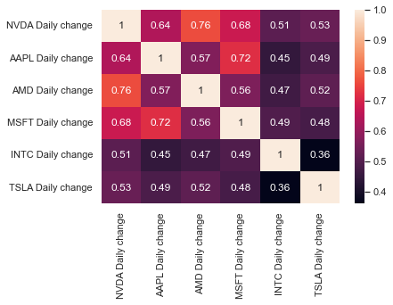
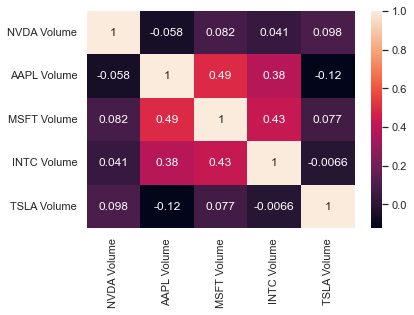
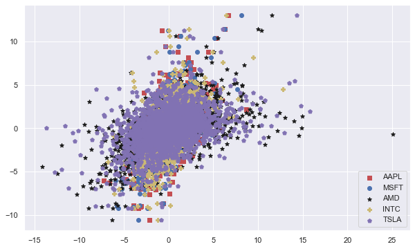

# Background

#### A share is a security issued by a company. All investors who bought the shares became co-owners of the company. The share just confirms that its owner has a share in the company, even minor.
#### More and more people begin to think about the possibility of investing and increasing at their capital. The most common way - starting your own business - requires a large amount of initial capital and personal participation. These circumstances limit the desire and possibilities of many. Thanks to the development of the Internet and computer technology, today everyone has the opportunity to invest in the financial stock market by trading securities and stocks over the Internet.
#### In our project we tried to find out if there is a possibility to predict Stock Market share price using other indexes within same sector ( technology). From our previous observation stock market tend to rise and fall all together , we used index`s such as MSFT . TSLA. AMD . INTC and NVIDA  share prices for the last 10 years.


# Imports 

```python
import re
import json
import csv
import requests
from bs4 import BeautifulSoup ,SoupStrainer
import pandas as pd 
from io import StringIO
from pathlib import Path  

#!pip install selenium

import os
from selenium import webdriver
from selenium.webdriver.common.keys import Keys
from selenium.webdriver.chrome.service import Service

import sys
import unittest
import time

```

```python
import time
from datetime import datetime, timedelta
import numpy as np; np.random.seed(0)
import warnings
import matplotlib as mpl
from matplotlib import pyplot as plt
%matplotlib inline
import seaborn as sns; sns.set_theme()
import datetime
from datetime import datetime
from sklearn import preprocessing
from sklearn.preprocessing import MinMaxScaler
import seaborn as sns
```


```python

from sklearn import linear_model


#visualization setup
import matplotlib.pyplot as plt
%matplotlib inline  
plt.rcParams['figure.figsize'] = (10, 6)

from mpl_toolkits.mplot3d import Axes3D
from matplotlib import cm
from sklearn.metrics import mean_squared_error
from sklearn.metrics import r2_score
```


```python
import matplotlib.pyplot as plt
from keras.models import Sequential
from keras.layers import Dense, LSTM
import math
from sklearn.preprocessing import MinMaxScaler
```

 
# Getting Data

## For our project we decided to use data from [yahoo finance](https://finance.yahoo.com/) website as it has all data that we need 

### Using web Scraping we encounter several issues with data collection such as:
#### Dynamic loading pages: 
 Data from yahoo finance was stored in dynamically loading json object, using [Selenium](https://pypi.org/project/selenium/) package we managed bypass that  issue and collect row data.
#### Inconsistent data:
 while loading page with web driver solved some problem the data we collected was inconsistent and some rows were missing   due to “fast scrolling” adjusting that value  allowed as to collect consistent data 
 
 * In our case, the optimal value of the parameter sleep_time = 2. It can be different for different pages.
 * Note: to run this part  of code, the chromedriver must be updated according to Your version of browser

```python
def get_infinity_page_html_data(chromedriver_path="./chromedriver.exe", scroll_number=50, sleep_time=2, url = ""):
    # Create selenium driver
    s = Service(chromedriver_path)
    driver = webdriver.Chrome(service=s)
    driver.get(url)

    for i in range(1,scroll_number):
        print(f"scroll_number: {i}")
        driver.execute_script("window.scrollTo(1,100000)")
        time.sleep(sleep_time)
    html_data = driver.page_source
    driver.close()
    
    soup = BeautifulSoup(html_data, 'html.parser')    
    return soup

```


```python
def make_table(soup):
    table = soup.find_all('table')
    df = pd.read_html(str(table))[0]
    return df
```

## Data cleaning 

* removing "Dividend" rows. Dividend is a payment. It means distribution of profits by a corporation between shareholders. If current row is Dividend we can remove it because othes values on this day are empty
* Stock split (or stock divide) increases the number of shares in a company. For example if the company had 1 million shares, and maks split 2:1, each will have a price 2 times lower than the original. Each owner of the previous 100 shares will now own 200 new shares. The nominal value of the shares is proportionally reduced.
```python
def data_cleaning(df):
    df = df[df["Open"].str.contains("Dividend") == False]
    df = df[df["Open"].str.contains("Stock") == False]
    df.drop(df.tail(1).index,inplace=True)
    return df
```


```python
def write_to_file(df, path):
    from pathlib import Path
    filepath = Path(path)
    filepath.parent.mkdir(parents=True, exist_ok=True)
    df.to_csv(filepath) 
```

## Web Driver 

### 

```python
base_url = "https://finance.yahoo.com/quote/"
period_url = "/history?period1=1262304000&period2=1651881600&interval=1d&filter=history&frequency=1d&includeAdjustedClose=true"
indexes = ["NVDA","AAPL","TSLA","AMD","MSFT","INTC"]
main_df = pd.DataFrame()

for index in indexes:
    soup = get_infinity_page_html_data(url = (base_url + index + period_url))
    table = soup.find_all('table')
    df = pd.read_html(str(table))[0]
    
    df = data_cleaning(df)
    
    path = index + ".csv"
    write_to_file(df, path)
    
```

###  
Doing so after combining all data together caused shifts in rows and or data wasn't synchronal . That caused wrong and illogical  visualizations so we needed to come back and rework our cleaning algorithm 

```python
indexes = ["NVDA","AAPL","TSLA","AMD","MSFT","INTC"]
main_df = pd.DataFrame()

for index in indexes:
    
    df = pd.read_csv( index + '.csv')
    df.drop(df.index[2500:], inplace=True)
    df.set_index('Date')
   
    
    main_df['Date'] = df['Date']
    main_df[index + " " + "Open"] = df['Open']
    main_df[index + " " + "High"] = df['High']
    main_df[index + " " + "Low"] = df['Low']
    main_df[index + " " + "Close"] = df['Close*']
    main_df[index + " " + "Volume"] = df['Volume']
    main_df[index + " " +'Daily change'] = (((df['Close*']).astype(float))-((df['Open']).astype(float)))/((df['Open']).astype(float))*100
    main_df[index + " " +'Daily change Max'] =  abs((df['High'].astype(float)-df['Low'].astype(float))/df['Low'].astype(float)*100)
    


    
    print(df)
    print(df.info())


main_df['Date'] = df['Date']
main_df.set_index('Date')
write_to_file(main_df, ("main_dataframe" + ".csv"))
main_df
```

          Unnamed: 0          Date    Open    High     Low  Close*  Adj Close**  \
    0              0  May 06, 2022  187.36  195.12  179.90  186.75       186.75   
    1              1  May 05, 2022  198.67  199.25  185.00  188.44       188.44   
    2              2  May 04, 2022  199.23  204.00  187.51  203.34       203.34   
    3              3  May 03, 2022  194.00  198.25  191.33  196.02       196.02   
    4              4  May 02, 2022  185.41  195.74  183.91  195.33       195.33   
    ...          ...           ...     ...     ...     ...     ...          ...   
    2495        2534  Jun 07, 2012    3.14    3.16    2.97    2.97         2.73   
    2496        2535  Jun 06, 2012    3.04    3.11    3.02    3.10         2.84   
    2497        2536  Jun 05, 2012    2.92    3.03    2.92    3.02         2.77   
    2498        2537  Jun 04, 2012    3.01    3.03    2.91    2.93         2.69   
    2499        2538  Jun 01, 2012    3.04    3.07    2.99    2.99         2.75   
    
            Volume  
    0     63299300  
    1     62633100  
    2     64885500  
    3     47575100  
    4     57204900  
    ...        ...  
    2495  52678000  
    2496  36896800  
    2497  36522400  
    2498  43285600  
    2499  44098400  
    
    [2500 rows x 8 columns]
    <class 'pandas.core.frame.DataFrame'>
    Int64Index: 2500 entries, 0 to 2499
    Data columns (total 8 columns):
     #   Column       Non-Null Count  Dtype  
    ---  ------       --------------  -----  
     0   Unnamed: 0   2500 non-null   int64  
     1   Date         2500 non-null   object 
     2   Open         2500 non-null   float64
     3   High         2500 non-null   float64
     4   Low          2500 non-null   float64
     5   Close*       2500 non-null   float64
     6   Adj Close**  2500 non-null   float64
     7   Volume       2500 non-null   int64  
    dtypes: float64(5), int64(2), object(1)
    memory usage: 175.8+ KB
    None
          Unnamed: 0          Date    Open    High     Low  Close*  Adj Close**  \
    0              0  May 06, 2022  156.01  159.44  154.18  157.28       157.28   
    1              2  May 05, 2022  163.85  164.08  154.95  156.77       156.54   
    2              3  May 04, 2022  159.67  166.48  159.26  166.02       165.78   
    3              4  May 03, 2022  158.15  160.71  156.32  159.48       159.25   
    4              5  May 02, 2022  156.71  158.23  153.27  157.96       157.73   
    ...          ...           ...     ...     ...     ...     ...          ...   
    2495        2537  Jun 07, 2012   20.62   20.62   20.38   20.42        17.46   
    2496        2538  Jun 06, 2012   20.28   20.49   20.20   20.41        17.45   
    2497        2539  Jun 05, 2012   20.05   20.23   19.94   20.10        17.19   
    2498        2540  Jun 04, 2012   20.05   20.27   19.59   20.15        17.23   
    2499        2541  Jun 01, 2012   20.33   20.45   20.02   20.04        17.13   
    
             Volume  
    0     116055700  
    1     130525300  
    2     108256500  
    3      88966500  
    4     123055300  
    ...         ...  
    2495  379766800  
    2496  401455600  
    2497  388214400  
    2498  556995600  
    2499  520987600  
    
    [2500 rows x 8 columns]
    <class 'pandas.core.frame.DataFrame'>
    Int64Index: 2500 entries, 0 to 2499
    Data columns (total 8 columns):
     #   Column       Non-Null Count  Dtype  
    ---  ------       --------------  -----  
     0   Unnamed: 0   2500 non-null   int64  
     1   Date         2500 non-null   object 
     2   Open         2500 non-null   float64
     3   High         2500 non-null   float64
     4   Low          2500 non-null   float64
     5   Close*       2500 non-null   float64
     6   Adj Close**  2500 non-null   float64
     7   Volume       2500 non-null   int64  
    dtypes: float64(5), int64(2), object(1)
    memory usage: 175.8+ KB
    None
          Unnamed: 0          Date    Open    High     Low  Close*  Adj Close**  \
    0              0  May 06, 2022  887.00  888.00  843.11  865.65       865.65   
    1              1  May 05, 2022  939.02  945.60  857.70  873.28       873.28   
    2              2  May 04, 2022  903.94  955.50  885.28  952.62       952.62   
    3              3  May 03, 2022  903.18  924.08  888.59  909.25       909.25   
    4              4  May 02, 2022  860.77  906.36  848.03  902.94       902.94   
    ...          ...           ...     ...     ...     ...     ...          ...   
    2495        2496  Jun 07, 2012    5.96    5.97    5.77    5.79         5.79   
    2496        2497  Jun 06, 2012    5.64    5.89    5.63    5.84         5.84   
    2497        2498  Jun 05, 2012    5.57    5.68    5.51    5.58         5.58   
    2498        2499  Jun 04, 2012    5.61    5.68    5.42    5.58         5.58   
    2499        2500  Jun 01, 2012    5.71    5.83    5.55    5.63         5.63   
    
  

<div>
<style scoped>
    .dataframe tbody tr th:only-of-type {
        vertical-align: middle;
    }

    .dataframe tbody tr th {
        vertical-align: top;
    }

    .dataframe thead th {
        text-align: right;
    }
</style>
<table border="1" class="dataframe">
  <thead>
    <tr style="text-align: right;">
      <th></th>
      <th>Date</th>
      <th>NVDA Open</th>
      <th>NVDA High</th>
      <th>NVDA Low</th>
      <th>NVDA Close</th>
      <th>NVDA Volume</th>
      <th>NVDA Daily change</th>
      <th>NVDA Daily change Max</th>
      <th>AAPL Open</th>
      <th>AAPL High</th>
      <th>...</th>
      <th>MSFT Volume</th>
      <th>MSFT Daily change</th>
      <th>MSFT Daily change Max</th>
      <th>INTC Open</th>
      <th>INTC High</th>
      <th>INTC Low</th>
      <th>INTC Close</th>
      <th>INTC Volume</th>
      <th>INTC Daily change</th>
      <th>INTC Daily change Max</th>
    </tr>
  </thead>
  <tbody>
    <tr>
      <th>0</th>
      <td>May 06, 2022</td>
      <td>187.36</td>
      <td>195.12</td>
      <td>179.90</td>
      <td>186.75</td>
      <td>63299300</td>
      <td>-0.325576</td>
      <td>8.460256</td>
      <td>156.01</td>
      <td>159.44</td>
      <td>...</td>
      <td>37748300</td>
      <td>-0.029111</td>
      <td>2.941719</td>
      <td>44.49</td>
      <td>45.15</td>
      <td>43.84</td>
      <td>44.30</td>
      <td>40910000</td>
      <td>-0.427062</td>
      <td>2.988139</td>
    </tr>
    <tr>
      <th>1</th>
      <td>May 05, 2022</td>
      <td>198.67</td>
      <td>199.25</td>
      <td>185.00</td>
      <td>188.44</td>
      <td>62633100</td>
      <td>-5.149242</td>
      <td>7.702703</td>
      <td>163.85</td>
      <td>164.08</td>
      <td>...</td>
      <td>43260400</td>
      <td>-2.868250</td>
      <td>4.377779</td>
      <td>45.60</td>
      <td>45.91</td>
      <td>44.13</td>
      <td>44.60</td>
      <td>52996700</td>
      <td>-2.192982</td>
      <td>4.033537</td>
    </tr>
    <tr>
      <th>2</th>
      <td>May 04, 2022</td>
      <td>199.23</td>
      <td>204.00</td>
      <td>187.51</td>
      <td>203.34</td>
      <td>64885500</td>
      <td>2.062942</td>
      <td>8.794198</td>
      <td>159.67</td>
      <td>166.48</td>
      <td>...</td>
      <td>33599300</td>
      <td>2.615096</td>
      <td>5.113287</td>
      <td>45.06</td>
      <td>46.64</td>
      <td>44.41</td>
      <td>46.54</td>
      <td>44625600</td>
      <td>3.284510</td>
      <td>5.021392</td>
    </tr>
    <tr>
      <th>3</th>
      <td>May 03, 2022</td>
      <td>194.00</td>
      <td>198.25</td>
      <td>191.33</td>
      <td>196.02</td>
      <td>47575100</td>
      <td>1.041237</td>
      <td>3.616788</td>
      <td>158.15</td>
      <td>160.71</td>
      <td>...</td>
      <td>25978600</td>
      <td>-0.767714</td>
      <td>1.420667</td>
      <td>44.79</td>
      <td>45.49</td>
      <td>44.23</td>
      <td>45.06</td>
      <td>40158400</td>
      <td>0.602813</td>
      <td>2.848745</td>
    </tr>
    <tr>
      <th>4</th>
      <td>May 02, 2022</td>
      <td>185.41</td>
      <td>195.74</td>
      <td>183.91</td>
      <td>195.33</td>
      <td>57204900</td>
      <td>5.350305</td>
      <td>6.432494</td>
      <td>156.71</td>
      <td>158.23</td>
      <td>...</td>
      <td>35151100</td>
      <td>2.434194</td>
      <td>3.156904</td>
      <td>43.72</td>
      <td>44.99</td>
      <td>43.51</td>
      <td>44.96</td>
      <td>45446500</td>
      <td>2.836231</td>
      <td>3.401517</td>
    </tr>
    <tr>
      <th>...</th>
      <td>...</td>
      <td>...</td>
      <td>...</td>
      <td>...</td>
      <td>...</td>
      <td>...</td>
      <td>...</td>
      <td>...</td>
      <td>...</td>
      <td>...</td>
      <td>...</td>
      <td>...</td>
      <td>...</td>
      <td>...</td>
      <td>...</td>
      <td>...</td>
      <td>...</td>
      <td>...</td>
      <td>...</td>
      <td>...</td>
      <td>...</td>
    </tr>
    <tr>
      <th>2495</th>
      <td>Jun 07, 2012</td>
      <td>3.14</td>
      <td>3.16</td>
      <td>2.97</td>
      <td>2.97</td>
      <td>52678000</td>
      <td>-5.414013</td>
      <td>6.397306</td>
      <td>20.62</td>
      <td>20.62</td>
      <td>...</td>
      <td>37792800</td>
      <td>-1.383266</td>
      <td>1.816935</td>
      <td>26.37</td>
      <td>26.43</td>
      <td>25.89</td>
      <td>25.94</td>
      <td>29534200</td>
      <td>-1.630641</td>
      <td>2.085747</td>
    </tr>
    <tr>
      <th>2496</th>
      <td>Jun 06, 2012</td>
      <td>3.04</td>
      <td>3.11</td>
      <td>3.02</td>
      <td>3.10</td>
      <td>36896800</td>
      <td>1.973684</td>
      <td>2.980132</td>
      <td>20.28</td>
      <td>20.49</td>
      <td>...</td>
      <td>46860500</td>
      <td>1.627424</td>
      <td>1.943770</td>
      <td>25.51</td>
      <td>26.11</td>
      <td>25.43</td>
      <td>26.07</td>
      <td>33553600</td>
      <td>2.195218</td>
      <td>2.674007</td>
    </tr>
    <tr>
      <th>2497</th>
      <td>Jun 05, 2012</td>
      <td>2.92</td>
      <td>3.03</td>
      <td>2.92</td>
      <td>3.02</td>
      <td>36522400</td>
      <td>3.424658</td>
      <td>3.767123</td>
      <td>20.05</td>
      <td>20.23</td>
      <td>...</td>
      <td>45715400</td>
      <td>0.000000</td>
      <td>1.268052</td>
      <td>25.04</td>
      <td>25.57</td>
      <td>25.00</td>
      <td>25.43</td>
      <td>29491300</td>
      <td>1.557508</td>
      <td>2.280000</td>
    </tr>
    <tr>
      <th>2498</th>
      <td>Jun 04, 2012</td>
      <td>3.01</td>
      <td>3.03</td>
      <td>2.91</td>
      <td>2.93</td>
      <td>43285600</td>
      <td>-2.657807</td>
      <td>4.123711</td>
      <td>20.05</td>
      <td>20.27</td>
      <td>...</td>
      <td>47926300</td>
      <td>-0.244584</td>
      <td>1.624294</td>
      <td>25.28</td>
      <td>25.36</td>
      <td>24.84</td>
      <td>25.04</td>
      <td>39903700</td>
      <td>-0.949367</td>
      <td>2.093398</td>
    </tr>
    <tr>
      <th>2499</th>
      <td>Jun 01, 2012</td>
      <td>3.04</td>
      <td>3.07</td>
      <td>2.99</td>
      <td>2.99</td>
      <td>44098400</td>
      <td>-1.644737</td>
      <td>2.675585</td>
      <td>20.33</td>
      <td>20.45</td>
      <td>...</td>
      <td>56634300</td>
      <td>-1.077886</td>
      <td>1.828411</td>
      <td>25.40</td>
      <td>25.71</td>
      <td>25.12</td>
      <td>25.14</td>
      <td>40246400</td>
      <td>-1.023622</td>
      <td>2.348726</td>
    </tr>
  </tbody>
</table>
<p>2500 rows × 43 columns</p>
</div>


```python
main_df.info()
```

    <class 'pandas.core.frame.DataFrame'>
    Int64Index: 2500 entries, 0 to 2499
    Data columns (total 48 columns):
     #   Column                 Non-Null Count  Dtype  
    ---  ------                 --------------  -----  
     0   NVDA Date              2500 non-null   object 
     1   NVDA Open              2500 non-null   float64
     2   NVDA High              2500 non-null   float64
     3   NVDA Low               2500 non-null   float64
     4   NVDA Close             2500 non-null   float64
     5   NVDA Volume            2500 non-null   int64  
     6   NVDA Daily change      2500 non-null   float64
     7   NVDA Daily change Max  2500 non-null   float64
     8   AAPL Date              2500 non-null   object 
     9   AAPL Open              2500 non-null   float64
     10  AAPL High              2500 non-null   float64
     11  AAPL Low               2500 non-null   float64
     12  AAPL Close             2500 non-null   float64
     13  AAPL Volume            2500 non-null   int64  
     14  AAPL Daily change      2500 non-null   float64
     15  AAPL Daily change Max  2500 non-null   float64
     16  TSLA Date              2500 non-null   object 
     17  TSLA Open              2500 non-null   float64
     18  TSLA High              2500 non-null   float64
     19  TSLA Low               2500 non-null   float64
     20  TSLA Close             2500 non-null   float64
     21  TSLA Volume            2500 non-null   int64  
     22  TSLA Daily change      2500 non-null   float64
     23  TSLA Daily change Max  2500 non-null   float64
     24  AMD Date               2500 non-null   object 
     25  AMD Open               2500 non-null   float64
     26  AMD High               2500 non-null   float64
     27  AMD Low                2500 non-null   float64
     28  AMD Close              2500 non-null   float64
     29  AMD Volume             2500 non-null   object 
     30  AMD Daily change       2500 non-null   float64
     31  AMD Daily change Max   2500 non-null   float64
     32  MSFT Date              2500 non-null   object 
     33  MSFT Open              2500 non-null   float64
     34  MSFT High              2500 non-null   float64
     35  MSFT Low               2500 non-null   float64
     36  MSFT Close             2500 non-null   float64
     37  MSFT Volume            2500 non-null   int64  
     38  MSFT Daily change      2500 non-null   float64
     39  MSFT Daily change Max  2500 non-null   float64
     40  INTC Date              2500 non-null   object 
     41  INTC Open              2500 non-null   float64
     42  INTC High              2500 non-null   float64
     43  INTC Low               2500 non-null   float64
     44  INTC Close             2500 non-null   float64
     45  INTC Volume            2500 non-null   int64  
     46  INTC Daily change      2500 non-null   float64
     47  INTC Daily change Max  2500 non-null   float64
    dtypes: float64(36), int64(5), object(7)
    memory usage: 957.0+ KB
    


```python
indexes = ["NVDA","AAPL","TSLA","AMD","MSFT","INTC"]

for index in indexes:
      
    main_df[index + " " +'Daily change'] = (((main_df[index + " " +'Close']).astype(float))-((main_df[index + " " +'Open']).astype(float)))/((main_df[index + " " +'Open']).astype(float))*100
    main_df[index + " " +'Daily change Max'] =  abs((main_df[index + " " +'High'].astype(float)-main_df[index + " " +'Low'].astype(float))/main_df[index + " " +'Low'].astype(float)*100)


write_to_file(main_df, ("main_dataframe" + ".csv"))

```


```python

```


```python
df = pd.read_csv('main_dataframe.csv')
df.drop('Unnamed: 0', inplace=True, axis=1)
df.dropna(inplace = True, axis=0)
df.info()
```

    <class 'pandas.core.frame.DataFrame'>
    Int64Index: 2500 entries, 0 to 2499
    Data columns (total 43 columns):
     #   Column                 Non-Null Count  Dtype  
    ---  ------                 --------------  -----  
     0   Date                   2500 non-null   object 
     1   NVDA Open              2500 non-null   float64
     2   NVDA High              2500 non-null   float64
     3   NVDA Low               2500 non-null   float64
     4   NVDA Close             2500 non-null   float64
     5   NVDA Volume            2500 non-null   int64  
     6   NVDA Daily change      2500 non-null   float64
     7   NVDA Daily change Max  2500 non-null   float64
     8   AAPL Open              2500 non-null   float64
     9   AAPL High              2500 non-null   float64
     10  AAPL Low               2500 non-null   float64
     11  AAPL Close             2500 non-null   float64
     12  AAPL Volume            2500 non-null   int64  
     13  AAPL Daily change      2500 non-null   float64
     14  AAPL Daily change Max  2500 non-null   float64
     15  TSLA Open              2500 non-null   float64
     16  TSLA High              2500 non-null   float64
     17  TSLA Low               2500 non-null   float64
     18  TSLA Close             2500 non-null   float64
     19  TSLA Volume            2500 non-null   int64  
     20  TSLA Daily change      2500 non-null   float64
     21  TSLA Daily change Max  2500 non-null   float64
     22  AMD Open               2500 non-null   float64
     23  AMD High               2500 non-null   float64
     24  AMD Low                2500 non-null   float64
     25  AMD Close              2500 non-null   float64
     26  AMD Volume             2500 non-null   object 
     27  AMD Daily change       2500 non-null   float64
     28  AMD Daily change Max   2500 non-null   float64
     29  MSFT Open              2500 non-null   float64
     30  MSFT High              2500 non-null   float64
     31  MSFT Low               2500 non-null   float64
     32  MSFT Close             2500 non-null   float64
     33  MSFT Volume            2500 non-null   int64  
     34  MSFT Daily change      2500 non-null   float64
     35  MSFT Daily change Max  2500 non-null   float64
     36  INTC Open              2500 non-null   float64
     37  INTC High              2500 non-null   float64
     38  INTC Low               2500 non-null   float64
     39  INTC Close             2500 non-null   float64
     40  INTC Volume            2500 non-null   int64  
     41  INTC Daily change      2500 non-null   float64
     42  INTC Daily change Max  2500 non-null   float64
    dtypes: float64(36), int64(5), object(2)
    memory usage: 859.4+ KB
    


```python
df.describe(include='all')
df.to_csv('main_dataframe.csv')
```


<div>
<style scoped>
    .dataframe tbody tr th:only-of-type {
        vertical-align: middle;
    }

    .dataframe tbody tr th {
        vertical-align: top;
    }

    .dataframe thead th {
        text-align: right;
    }
</style>
<table border="1" class="dataframe">
  <thead>
    <tr style="text-align: right;">
      <th></th>
      <th>Date</th>
      <th>NVDA Open</th>
      <th>NVDA High</th>
      <th>NVDA Low</th>
      <th>NVDA Close</th>
      <th>NVDA Volume</th>
      <th>NVDA Daily change</th>
      <th>NVDA Daily change Max</th>
      <th>AAPL Open</th>
      <th>AAPL High</th>
      <th>...</th>
      <th>MSFT Volume</th>
      <th>MSFT Daily change</th>
      <th>MSFT Daily change Max</th>
      <th>INTC Open</th>
      <th>INTC High</th>
      <th>INTC Low</th>
      <th>INTC Close</th>
      <th>INTC Volume</th>
      <th>INTC Daily change</th>
      <th>INTC Daily change Max</th>
    </tr>
  </thead>
  <tbody>
    <tr>
      <th>count</th>
      <td>2500</td>
      <td>2500.000000</td>
      <td>2500.000000</td>
      <td>2500.000000</td>
      <td>2500.000000</td>
      <td>2.500000e+03</td>
      <td>2500.000000</td>
      <td>2500.000000</td>
      <td>2500.000000</td>
      <td>2500.000000</td>
      <td>...</td>
      <td>2.500000e+03</td>
      <td>2500.000000</td>
      <td>2500.000000</td>
      <td>2500.000000</td>
      <td>2500.000000</td>
      <td>2500.000000</td>
      <td>2500.000000</td>
      <td>2.500000e+03</td>
      <td>2500.000000</td>
      <td>2500.000000</td>
    </tr>
    <tr>
      <th>unique</th>
      <td>2500</td>
      <td>NaN</td>
      <td>NaN</td>
      <td>NaN</td>
      <td>NaN</td>
      <td>NaN</td>
      <td>NaN</td>
      <td>NaN</td>
      <td>NaN</td>
      <td>NaN</td>
      <td>...</td>
      <td>NaN</td>
      <td>NaN</td>
      <td>NaN</td>
      <td>NaN</td>
      <td>NaN</td>
      <td>NaN</td>
      <td>NaN</td>
      <td>NaN</td>
      <td>NaN</td>
      <td>NaN</td>
    </tr>
    <tr>
      <th>top</th>
      <td>May 06, 2022</td>
      <td>NaN</td>
      <td>NaN</td>
      <td>NaN</td>
      <td>NaN</td>
      <td>NaN</td>
      <td>NaN</td>
      <td>NaN</td>
      <td>NaN</td>
      <td>NaN</td>
      <td>...</td>
      <td>NaN</td>
      <td>NaN</td>
      <td>NaN</td>
      <td>NaN</td>
      <td>NaN</td>
      <td>NaN</td>
      <td>NaN</td>
      <td>NaN</td>
      <td>NaN</td>
      <td>NaN</td>
    </tr>
    <tr>
      <th>freq</th>
      <td>1</td>
      <td>NaN</td>
      <td>NaN</td>
      <td>NaN</td>
      <td>NaN</td>
      <td>NaN</td>
      <td>NaN</td>
      <td>NaN</td>
      <td>NaN</td>
      <td>NaN</td>
      <td>...</td>
      <td>NaN</td>
      <td>NaN</td>
      <td>NaN</td>
      <td>NaN</td>
      <td>NaN</td>
      <td>NaN</td>
      <td>NaN</td>
      <td>NaN</td>
      <td>NaN</td>
      <td>NaN</td>
    </tr>
    <tr>
      <th>mean</th>
      <td>NaN</td>
      <td>55.036220</td>
      <td>56.007012</td>
      <td>53.956608</td>
      <td>55.010704</td>
      <td>4.397544e+07</td>
      <td>0.054706</td>
      <td>3.062827</td>
      <td>54.377492</td>
      <td>54.962748</td>
      <td>...</td>
      <td>3.331913e+07</td>
      <td>0.044444</td>
      <td>1.850186</td>
      <td>40.120048</td>
      <td>40.553280</td>
      <td>39.702296</td>
      <td>40.136216</td>
      <td>3.001400e+07</td>
      <td>0.054467</td>
      <td>2.060457</td>
    </tr>
    <tr>
      <th>std</th>
      <td>NaN</td>
      <td>70.818638</td>
      <td>72.240196</td>
      <td>69.149726</td>
      <td>70.709059</td>
      <td>2.588744e+07</td>
      <td>2.129932</td>
      <td>1.887537</td>
      <td>43.939634</td>
      <td>44.488901</td>
      <td>...</td>
      <td>1.743158e+07</td>
      <td>1.245177</td>
      <td>1.117357</td>
      <td>12.325563</td>
      <td>12.510381</td>
      <td>12.136461</td>
      <td>12.322022</td>
      <td>1.541830e+07</td>
      <td>1.388051</td>
      <td>1.251787</td>
    </tr>
    <tr>
      <th>min</th>
      <td>NaN</td>
      <td>2.870000</td>
      <td>2.910000</td>
      <td>2.790000</td>
      <td>2.850000</td>
      <td>4.564400e+06</td>
      <td>-10.580964</td>
      <td>0.723327</td>
      <td>13.860000</td>
      <td>14.270000</td>
      <td>...</td>
      <td>7.425600e+06</td>
      <td>-5.924658</td>
      <td>0.375509</td>
      <td>19.520000</td>
      <td>19.550000</td>
      <td>19.230000</td>
      <td>19.360000</td>
      <td>5.893800e+06</td>
      <td>-6.818865</td>
      <td>0.476417</td>
    </tr>
    <tr>
      <th>25%</th>
      <td>NaN</td>
      <td>4.930000</td>
      <td>4.990000</td>
      <td>4.870000</td>
      <td>4.920000</td>
      <td>2.748940e+07</td>
      <td>-1.003136</td>
      <td>1.831410</td>
      <td>24.575000</td>
      <td>24.805000</td>
      <td>...</td>
      <td>2.273332e+07</td>
      <td>-0.599056</td>
      <td>1.160418</td>
      <td>30.237500</td>
      <td>30.560000</td>
      <td>29.950000</td>
      <td>30.340000</td>
      <td>2.042192e+07</td>
      <td>-0.680199</td>
      <td>1.308157</td>
    </tr>
    <tr>
      <th>50%</th>
      <td>NaN</td>
      <td>32.700000</td>
      <td>33.660000</td>
      <td>31.905000</td>
      <td>32.845000</td>
      <td>3.759320e+07</td>
      <td>0.007453</td>
      <td>2.524539</td>
      <td>36.265000</td>
      <td>36.540000</td>
      <td>...</td>
      <td>2.914835e+07</td>
      <td>0.053735</td>
      <td>1.556730</td>
      <td>36.555000</td>
      <td>36.890000</td>
      <td>36.295000</td>
      <td>36.570000</td>
      <td>2.645245e+07</td>
      <td>0.057092</td>
      <td>1.755663</td>
    </tr>
    <tr>
      <th>75%</th>
      <td>NaN</td>
      <td>62.982500</td>
      <td>63.650000</td>
      <td>62.090000</td>
      <td>62.995000</td>
      <td>5.256732e+07</td>
      <td>1.178003</td>
      <td>3.698139</td>
      <td>61.850000</td>
      <td>63.377500</td>
      <td>...</td>
      <td>3.829908e+07</td>
      <td>0.746700</td>
      <td>2.189969</td>
      <td>50.555000</td>
      <td>51.222500</td>
      <td>49.972500</td>
      <td>50.627500</td>
      <td>3.479328e+07</td>
      <td>0.768131</td>
      <td>2.456795</td>
    </tr>
    <tr>
      <th>max</th>
      <td>NaN</td>
      <td>335.170000</td>
      <td>346.470000</td>
      <td>320.360000</td>
      <td>333.760000</td>
      <td>3.692928e+08</td>
      <td>13.004996</td>
      <td>18.044270</td>
      <td>182.630000</td>
      <td>182.940000</td>
      <td>...</td>
      <td>2.484285e+08</td>
      <td>8.102455</td>
      <td>15.050096</td>
      <td>68.200000</td>
      <td>69.290000</td>
      <td>67.310000</td>
      <td>68.470000</td>
      <td>1.822699e+08</td>
      <td>12.784915</td>
      <td>19.757048</td>
    </tr>
  </tbody>
</table>
<p>11 rows × 43 columns</p>
</div>


```python
df['Date'] = pd.to_datetime(df['Date']).copy()
df["Date"]= pd.to_datetime(df.Date,format="%Y-%m-%d").copy()
#df['Date'] = pd.to_numeric(pd.to_datetime(df['Date'])).copy()
i = 0
df["Day"] = 0 
while i  < 2500:
    temp = pd.Timestamp(df["Date"][i])
    df['Day'][i] = temp.dayofweek
    i=i+1
```

    C:\Users\vikto\AppData\Local\Temp/ipykernel_35548/314205087.py:8: SettingWithCopyWarning: 
    A value is trying to be set on a copy of a slice from a DataFrame
    
    See the caveats in the documentation: https://pandas.pydata.org/pandas-docs/stable/user_guide/indexing.html#returning-a-view-versus-a-copy
      df['Day'][i] = temp.dayofweek
    


```python
df.head()
```


<div>
<style scoped>
    .dataframe tbody tr th:only-of-type {
        vertical-align: middle;
    }

    .dataframe tbody tr th {
        vertical-align: top;
    }

    .dataframe thead th {
        text-align: right;
    }
</style>
<table border="1" class="dataframe">
  <thead>
    <tr style="text-align: right;">
      <th></th>
      <th>Date</th>
      <th>NVDA Open</th>
      <th>NVDA High</th>
      <th>NVDA Low</th>
      <th>NVDA Close</th>
      <th>NVDA Volume</th>
      <th>NVDA Daily change</th>
      <th>NVDA Daily change Max</th>
      <th>AAPL Open</th>
      <th>AAPL High</th>
      <th>...</th>
      <th>MSFT Daily change</th>
      <th>MSFT Daily change Max</th>
      <th>INTC Open</th>
      <th>INTC High</th>
      <th>INTC Low</th>
      <th>INTC Close</th>
      <th>INTC Volume</th>
      <th>INTC Daily change</th>
      <th>INTC Daily change Max</th>
      <th>Day</th>
    </tr>
  </thead>
  <tbody>
    <tr>
      <th>0</th>
      <td>2022-05-06</td>
      <td>187.36</td>
      <td>195.12</td>
      <td>179.90</td>
      <td>186.75</td>
      <td>63299300</td>
      <td>-0.325576</td>
      <td>8.460256</td>
      <td>156.01</td>
      <td>159.44</td>
      <td>...</td>
      <td>-0.029111</td>
      <td>2.941719</td>
      <td>44.49</td>
      <td>45.15</td>
      <td>43.84</td>
      <td>44.30</td>
      <td>40910000</td>
      <td>-0.427062</td>
      <td>2.988139</td>
      <td>4</td>
    </tr>
    <tr>
      <th>1</th>
      <td>2022-05-05</td>
      <td>198.67</td>
      <td>199.25</td>
      <td>185.00</td>
      <td>188.44</td>
      <td>62633100</td>
      <td>-5.149242</td>
      <td>7.702703</td>
      <td>163.85</td>
      <td>164.08</td>
      <td>...</td>
      <td>-2.868250</td>
      <td>4.377779</td>
      <td>45.60</td>
      <td>45.91</td>
      <td>44.13</td>
      <td>44.60</td>
      <td>52996700</td>
      <td>-2.192982</td>
      <td>4.033537</td>
      <td>3</td>
    </tr>
    <tr>
      <th>2</th>
      <td>2022-05-04</td>
      <td>199.23</td>
      <td>204.00</td>
      <td>187.51</td>
      <td>203.34</td>
      <td>64885500</td>
      <td>2.062942</td>
      <td>8.794198</td>
      <td>159.67</td>
      <td>166.48</td>
      <td>...</td>
      <td>2.615096</td>
      <td>5.113287</td>
      <td>45.06</td>
      <td>46.64</td>
      <td>44.41</td>
      <td>46.54</td>
      <td>44625600</td>
      <td>3.284510</td>
      <td>5.021392</td>
      <td>2</td>
    </tr>
    <tr>
      <th>3</th>
      <td>2022-05-03</td>
      <td>194.00</td>
      <td>198.25</td>
      <td>191.33</td>
      <td>196.02</td>
      <td>47575100</td>
      <td>1.041237</td>
      <td>3.616788</td>
      <td>158.15</td>
      <td>160.71</td>
      <td>...</td>
      <td>-0.767714</td>
      <td>1.420667</td>
      <td>44.79</td>
      <td>45.49</td>
      <td>44.23</td>
      <td>45.06</td>
      <td>40158400</td>
      <td>0.602813</td>
      <td>2.848745</td>
      <td>1</td>
    </tr>
    <tr>
      <th>4</th>
      <td>2022-05-02</td>
      <td>185.41</td>
      <td>195.74</td>
      <td>183.91</td>
      <td>195.33</td>
      <td>57204900</td>
      <td>5.350305</td>
      <td>6.432494</td>
      <td>156.71</td>
      <td>158.23</td>
      <td>...</td>
      <td>2.434194</td>
      <td>3.156904</td>
      <td>43.72</td>
      <td>44.99</td>
      <td>43.51</td>
      <td>44.96</td>
      <td>45446500</td>
      <td>2.836231</td>
      <td>3.401517</td>
      <td>0</td>
    </tr>
  </tbody>
</table>
<p>5 rows × 44 columns</p>
</div>


```python
tdf = pd.DataFrame(df, columns = ['Day','TSLA Daily change'])
sns.violinplot(tdf.Day , tdf['TSLA Daily change'])
```

    D:\Programs\Anaconda\lib\site-packages\seaborn\_decorators.py:36: FutureWarning: Pass the following variables as keyword args: x, y. From version 0.12, the only valid positional argument will be `data`, and passing other arguments without an explicit keyword will result in an error or misinterpretation.
      warnings.warn(
    


    <AxesSubplot:xlabel='Day', ylabel='TSLA Daily change'>


    

    


```python
tdf = pd.DataFrame(df, columns = ['Day','NVDA Daily change'])
sns.violinplot(tdf.Day , tdf['NVDA Daily change'])
```

    D:\Programs\Anaconda\lib\site-packages\seaborn\_decorators.py:36: FutureWarning: Pass the following variables as keyword args: x, y. From version 0.12, the only valid positional argument will be `data`, and passing other arguments without an explicit keyword will result in an error or misinterpretation.
      warnings.warn(
    


    <AxesSubplot:xlabel='Day', ylabel='NVDA Daily change'>


    

    


```python
tdf = pd.DataFrame(df, columns = ['Day','TSLA Daily change'])
tdf.drop(tdf.index[500:2548], inplace=True) 
sns.violinplot(tdf.Day , tdf['TSLA Daily change'])
```

    D:\Programs\Anaconda\lib\site-packages\seaborn\_decorators.py:36: FutureWarning: Pass the following variables as keyword args: x, y. From version 0.12, the only valid positional argument will be `data`, and passing other arguments without an explicit keyword will result in an error or misinterpretation.
      warnings.warn(
    


    <AxesSubplot:xlabel='Day', ylabel='TSLA Daily change'>


    

    


```python
tdf = pd.DataFrame(df, columns = ['Day','NVDA Daily change'])
tdf.drop(tdf.index[500:2548], inplace=True) 
sns.violinplot(tdf.Day , tdf['NVDA Daily change'])
```

    D:\Programs\Anaconda\lib\site-packages\seaborn\_decorators.py:36: FutureWarning: Pass the following variables as keyword args: x, y. From version 0.12, the only valid positional argument will be `data`, and passing other arguments without an explicit keyword will result in an error or misinterpretation.
      warnings.warn(
    


    <AxesSubplot:xlabel='Day', ylabel='NVDA Daily change'>


    

    


```python
tdf = pd.DataFrame(df, columns = ['NVDA Daily change','AAPL Daily change','AMD Daily change','MSFT Daily change','INTC Daily change','TSLA Daily change'])

#tdf.drop(tdf.index[300:2548], inplace=True)

#tdf.tail()


sns.heatmap(tdf.corr(), annot=True)
```


    <AxesSubplot:>


    

    


```python
tdf = pd.DataFrame(df, columns = ['NVDA Daily change','AAPL Daily change','AMD Daily change','MSFT Daily change','INTC Daily change','TSLA Daily change'])

tdf.drop(tdf.index[500:2548], inplace=True)

#tdf.tail()


sns.heatmap(tdf.corr(), annot=True)
```


    <AxesSubplot:>


    

    


```python
tdf = pd.DataFrame(df, columns = ['NVDA Volume','AAPL Volume','AMD Volume','MSFT Volume','INTC Volume','TSLA Volume'])
sns.heatmap(tdf.corr(), annot=True)
```


    <AxesSubplot:>


    

    


```python
tdf = pd.DataFrame(df, columns = ['NVDA Close','AAPL Close','AMD Close','MSFT Close','TSLA Close'])
sns.heatmap(tdf.corr(), annot=True)
```


    <AxesSubplot:>


    

    


```python
tdf = pd.DataFrame(df, columns = ['NVDA Daily change Max','AAPL Daily change Max','AMD Daily change Max','MSFT Daily change Max','INTC Daily change Max','TSLA Daily change Max'])
sns.heatmap(tdf.corr(), annot=True)
```


    <AxesSubplot:>


    

    


```python

```


    <AxesSubplot:>


    

    


```python
tdf = pd.DataFrame(df, columns = ['NVDA Volume','NVDA Open','NVDA Close','NVDA Daily change','NVDA Daily change Max'])
sns.heatmap(tdf.corr(), annot=True)
```


    <AxesSubplot:>


    

    


```python

```


```python
df = pd.read_csv('main_dataframe.csv')
```


```python
plt.scatter(x=df['AAPL Daily change'],y=df['NVDA Daily change'],c='r',marker='s',label='AAPL')
plt.scatter(x=df['MSFT Daily change'],y=df['NVDA Daily change'],c='b',marker='o',label='MSFT')
plt.scatter(x=df['AMD Daily change'],y=df['NVDA Daily change'],c='k',marker='*',label='AMD')
plt.scatter(x=df['INTC Daily change'],y=df['NVDA Daily change'],c='y',marker='P',label='INTC')
plt.scatter(x=df['TSLA Daily change'],y=df['NVDA Daily change'],c='m',marker='p',label='TSLA')
plt.legend(numpoints=2,loc=4)
plt.show()

```


    

    


```python
tdf = pd.DataFrame(df, columns = ['NVDA Close'])
tdf['Predicted Close'] = ((df['NVDA Open']*5+df['AAPL Daily change']*df['NVDA Open']/100+df['AMD Daily change']*df['NVDA Open']/100+df['INTC Daily change']*df['NVDA Open']/100+df['MSFT Daily change']*df['NVDA Open']/100+df['TSLA Daily change']*df['NVDA Open']/100)/5) 
tdf
tdf.drop(tdf.index[1000:2548], inplace=True)        
```


```python
m=linear_model.LinearRegression().fit(tdf.iloc[:,1:2],tdf.iloc[:,0:1])
```


```python
plt.scatter(x=tdf['Predicted Close'],y=tdf['NVDA Close'],c='r',marker='*',label='Index')
plt.plot(tdf['Predicted Close'],m.predict(tdf.iloc[:,1:2]),'k',color='blue',linewidth=3)
plt.show()
```

    C:\Users\vikto\AppData\Local\Temp/ipykernel_35548/764479585.py:2: UserWarning: color is redundantly defined by the 'color' keyword argument and the fmt string "k" (-> color=(0.1, 0.1, 0.1, 1)). The keyword argument will take precedence.
      plt.plot(tdf['Predicted Close'],m.predict(tdf.iloc[:,1:2]),'k',color='blue',linewidth=3)
    


    

    


```python
print("b1:",m.coef_)
print("b0:",m.intercept_)
```

    b1: [[0.99792163]]
    b0: [0.15412335]
    


```python
def sse(Y, Y_HAT):  
    sse = sum([(y - y_hat)**2 for y,y_hat in zip(Y, Y_HAT)])
    return sse

SSE = sse(tdf['NVDA Close'].tolist(),m.predict(tdf.iloc[:,1:2]).flatten())

print(SSE)
```

    6334.358276175956
    


```python
mean_squared_error(tdf['NVDA Close'].tolist(),m.predict(tdf.iloc[:,1:2]).flatten())*len(tdf['NVDA Close'].tolist())
```


    6334.358276175948


```python
r2_score(tdf['NVDA Close'].tolist(),m.predict(tdf.iloc[:,1:2]).flatten())
```


    0.9989491250995026


```python

```


```python
df = pd.read_csv('main_dataframe.csv')
```


```python
tdf = pd.DataFrame(df, columns = ['Date','NVDA Close','AAPL Close','AMD Close','MSFT Close','TSLA Close'])
tdf = tdf.iloc[::-1]
tdf = tdf.tail(500)  
```


```python
close_data = tdf.filter(['NVDA Close'])
dataset = close_data.values
```


```python
scaler = MinMaxScaler(feature_range=(0, 1))
scaled_data = scaler.fit_transform(dataset)
```


```python
training_data_len = math.ceil(len(dataset) *.8)
train_data = scaled_data[0:training_data_len  , : ]
```


```python
x_train_data=[]
y_train_data =[]
for i in range(60,len(train_data)):
    x_train_data=list(x_train_data)
    y_train_data=list(y_train_data)
    x_train_data.append(train_data[i-60:i,0])
    y_train_data.append(train_data[i,0])
    
    x_train_data1, y_train_data1 = np.array(x_train_data), np.array(y_train_data)
    
    x_train_data2 = np.reshape(x_train_data1, (x_train_data1.shape[0],x_train_data1.shape[1],1))
```


```python
model = Sequential()
model.add(LSTM(units=50, return_sequences=True,input_shape=(x_train_data2.shape[1],1)))
model.add(LSTM(units=50, return_sequences=False))
model.add(Dense(units=25))
model.add(Dense(units=1))
```


```python
model.compile(optimizer='adam', loss='mean_squared_error')
model.fit(x_train_data2, y_train_data1, batch_size=1, epochs=1)
```

    340/340 [==============================] - 4s 8ms/step - loss: 0.0052
    


    <keras.callbacks.History at 0x268305e6be0>


```python
test_data = scaled_data[training_data_len - 60: , : ]
x_test = []
y_test =  dataset[training_data_len : , : ]
for i in range(60,len(test_data)):
    x_test.append(test_data[i-60:i,0])
```


```python
x_test = np.array(x_test)
```


```python
predictions = model.predict(x_test)
predictions = scaler.inverse_transform(predictions)
```

    WARNING:tensorflow:5 out of the last 14 calls to <function Model.make_predict_function.<locals>.predict_function at 0x0000026830645160> triggered tf.function retracing. Tracing is expensive and the excessive number of tracings could be due to (1) creating @tf.function repeatedly in a loop, (2) passing tensors with different shapes, (3) passing Python objects instead of tensors. For (1), please define your @tf.function outside of the loop. For (2), @tf.function has experimental_relax_shapes=True option that relaxes argument shapes that can avoid unnecessary retracing. For (3), please refer to https://www.tensorflow.org/guide/function#controlling_retracing and https://www.tensorflow.org/api_docs/python/tf/function for  more details.
    


```python
rmse=np.sqrt(np.mean(((predictions- y_test)**2)))
print(rmse)
```

    18.215237917282103
    


```python
train = tdf[:training_data_len]
valid = tdf[training_data_len:]
 
valid['Predictions'] = predictions
 
plt.title('Model')
plt.xlabel('Date')
plt.ylabel('Close')
 
plt.plot(train['NVDA Close'])
plt.plot(valid[['NVDA Close', 'Predictions']])
 
plt.legend(['Train', 'Val', 'Predictions'], loc='lower right')
 
plt.show()
```

    C:\Users\vikto\AppData\Local\Temp/ipykernel_35548/2931567003.py:4: SettingWithCopyWarning: 
    A value is trying to be set on a copy of a slice from a DataFrame.
    Try using .loc[row_indexer,col_indexer] = value instead
    
    See the caveats in the documentation: https://pandas.pydata.org/pandas-docs/stable/user_guide/indexing.html#returning-a-view-versus-a-copy
      valid['Predictions'] = predictions
    


    

    


```python
Data = list(zip(predictions, y_test))
df = pd.DataFrame(Data,columns=['Predictions', 'Actual'])
df
```


<div>
<style scoped>
    .dataframe tbody tr th:only-of-type {
        vertical-align: middle;
    }

    .dataframe tbody tr th {
        vertical-align: top;
    }

    .dataframe thead th {
        text-align: right;
    }
</style>
<table border="1" class="dataframe">
  <thead>
    <tr style="text-align: right;">
      <th></th>
      <th>Predictions</th>
      <th>Actual</th>
    </tr>
  </thead>
  <tbody>
    <tr>
      <th>0</th>
      <td>[300.93384]</td>
      <td>[283.37]</td>
    </tr>
    <tr>
      <th>1</th>
      <td>[297.20834]</td>
      <td>[304.59]</td>
    </tr>
    <tr>
      <th>2</th>
      <td>[294.71936]</td>
      <td>[283.87]</td>
    </tr>
    <tr>
      <th>3</th>
      <td>[291.7839]</td>
      <td>[278.01]</td>
    </tr>
    <tr>
      <th>4</th>
      <td>[288.4805]</td>
      <td>[277.19]</td>
    </tr>
    <tr>
      <th>...</th>
      <td>...</td>
      <td>...</td>
    </tr>
    <tr>
      <th>95</th>
      <td>[194.56708]</td>
      <td>[195.33]</td>
    </tr>
    <tr>
      <th>96</th>
      <td>[192.49495]</td>
      <td>[196.02]</td>
    </tr>
    <tr>
      <th>97</th>
      <td>[191.14067]</td>
      <td>[203.34]</td>
    </tr>
    <tr>
      <th>98</th>
      <td>[190.79495]</td>
      <td>[188.44]</td>
    </tr>
    <tr>
      <th>99</th>
      <td>[190.22234]</td>
      <td>[186.75]</td>
    </tr>
  </tbody>
</table>
<p>100 rows × 2 columns</p>
</div>


```python

```


```python
df = pd.read_csv('main_dataframe.csv')
```


```python
tdf = pd.DataFrame(df, columns = ['Date','NVDA Close','NVDA Open','NVDA Low','NVDA High','NVDA Volume'])
tdf = tdf.iloc[::-1]
tdf = tdf.tail(500)  
```


```python
close_data = tdf.filter(['NVDA Close'])
dataset = close_data.values

scaler = MinMaxScaler(feature_range=(0, 1))
scaled_data = scaler.fit_transform(dataset)

training_data_len = math.ceil(len(dataset) *.8)
train_data = scaled_data[0:training_data_len  , : ]


```


```python
x_train_data=[]
y_train_data =[]
for i in range(60,len(train_data)):
    x_train_data=list(x_train_data)
    y_train_data=list(y_train_data)
    x_train_data.append(train_data[i-60:i,0])
    y_train_data.append(train_data[i,0])
    
    x_train_data1, y_train_data1 = np.array(x_train_data), np.array(y_train_data)
    
    x_train_data2 = np.reshape(x_train_data1, (x_train_data1.shape[0],x_train_data1.shape[1],1))
```


```python
model = Sequential()
model.add(LSTM(units=50, return_sequences=True,input_shape=(x_train_data2.shape[1],1)))
model.add(LSTM(units=50, return_sequences=False))
model.add(Dense(units=25))
model.add(Dense(units=1))
```


```python
model.compile(optimizer='adam', loss='mean_squared_error')
model.fit(x_train_data2, y_train_data1, batch_size=1, epochs=1)
```

    340/340 [==============================] - 4s 8ms/step - loss: 0.0050
    


    <keras.callbacks.History at 0x268886860a0>


```python
test_data = scaled_data[training_data_len - 60: , : ]
x_test = []
y_test =  dataset[training_data_len : , : ]
for i in range(60,len(test_data)):
    x_test.append(test_data[i-60:i,0])
```


```python
x_test = np.array(x_test)
```


```python
predictions = model.predict(x_test)
predictions = scaler.inverse_transform(predictions)
```


```python
rmse=np.sqrt(np.mean(((predictions- y_test)**2)))
print(rmse)
```

    21.68927375212881
    


```python
train = tdf[:training_data_len]
valid = tdf[training_data_len:]
 
valid['Predictions'] = predictions
 
plt.title('Model')
plt.xlabel('Date')
plt.ylabel('Close')
 
plt.plot(train['NVDA Close'])
plt.plot(valid[['NVDA Close', 'Predictions']])
 
plt.legend(['Train', 'Val', 'Predictions'], loc='lower right')
 
plt.show()
```

    C:\Users\vikto\AppData\Local\Temp/ipykernel_35548/2931567003.py:4: SettingWithCopyWarning: 
    A value is trying to be set on a copy of a slice from a DataFrame.
    Try using .loc[row_indexer,col_indexer] = value instead
    
    See the caveats in the documentation: https://pandas.pydata.org/pandas-docs/stable/user_guide/indexing.html#returning-a-view-versus-a-copy
      valid['Predictions'] = predictions
    


    

    


```python

```


```python

```


```python
tdf = pd.read_csv('main_dataframe.csv')
tdf = tdf.iloc[::-1]
tdf = tdf.tail(500) 
X = 10 #prediction sepmle 
```


```python
close_data = tdf.filter(['NVDA Close'])
dataset = close_data.values
```


```python
scaler = MinMaxScaler(feature_range=(0, 1))
scaled_data = scaler.fit_transform(dataset)
```


```python
training_data_len = math.ceil(len(dataset) *.8)
train_data = scaled_data[0:training_data_len  , : ]
```


```python
x_train_data=[]
y_train_data =[]
for i in range(X,len(train_data)):
    x_train_data=list(x_train_data)
    y_train_data=list(y_train_data)
    x_train_data.append(train_data[i-X:i,0])
    y_train_data.append(train_data[i,0])
    
    x_train_data1, y_train_data1 = np.array(x_train_data), np.array(y_train_data)
    
    x_train_data2 = np.reshape(x_train_data1, (x_train_data1.shape[0],x_train_data1.shape[1],1))
```


```python
model = Sequential()
model.add(LSTM(units=50, return_sequences=True,input_shape=(x_train_data2.shape[1],1)))
model.add(LSTM(units=50, return_sequences=False))
model.add(Dense(units=25))
model.add(Dense(units=1))
```


```python
model.compile(optimizer='adam', loss='mean_squared_error')
model.fit(x_train_data2, y_train_data1, batch_size=1, epochs=1)
```

    390/390 [==============================] - 2s 2ms/step - loss: 0.0062
    


    <keras.callbacks.History at 0x268863fac70>


```python
test_data = scaled_data[training_data_len - X
                        : , : ]
x_test = []
y_test =  dataset[training_data_len : , : ]
for i in range(X,len(test_data)):
    x_test.append(test_data[i-X:i,0])
```


```python
x_test = np.array(x_test)
predictions = model.predict(x_test)
predictions = scaler.inverse_transform(predictions)
```


```python
rmse=np.sqrt(np.mean(((predictions- y_test)**2)))
print(rmse)
```

    18.46273978395024
    


```python
train = tdf[:training_data_len]
valid = tdf[training_data_len:]
 
valid['Predictions'] = predictions
 
plt.title('Model')
plt.xlabel('Date')
plt.ylabel('Close')
 
plt.plot(train['NVDA Close'])
plt.plot(valid[['NVDA Close', 'Predictions']])
 
plt.legend(['Train', 'Val', 'Predictions'], loc='lower right')
 
plt.show()
```

    C:\Users\vikto\AppData\Local\Temp/ipykernel_35548/2931567003.py:4: SettingWithCopyWarning: 
    A value is trying to be set on a copy of a slice from a DataFrame.
    Try using .loc[row_indexer,col_indexer] = value instead
    
    See the caveats in the documentation: https://pandas.pydata.org/pandas-docs/stable/user_guide/indexing.html#returning-a-view-versus-a-copy
      valid['Predictions'] = predictions
    


    

    


```python

```


```python

```


```python

```
